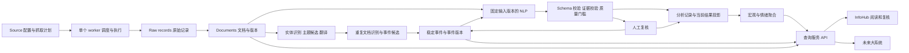
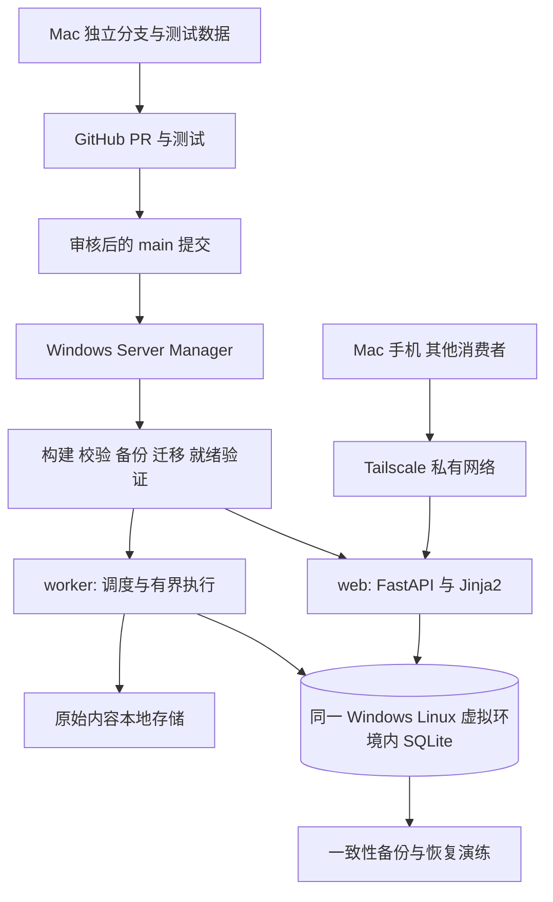

# InfoHub 产品与技术 SPEC

版本：1.0-draft · 日期：2026-09-14（UTC）· 状态：供审阅的架构基线，尚未实施。

基于 `main@88a2a1ef16e5`、未合并的 PR #1 `b18d08130fe2`、Windows 在线只读检查及本地数据库快照。本文的“必须”是后续实现与验收要求，不代表现有系统已经做到。未合并 PR 的设计不自动成为正式契约。

## 0. 阅读入口与文档治理

| 文档 | 回答的问题 |
|---|---|
| [架构审计](docs/spec/AUDIT.md) | 当前真正有什么、哪里有问题、证据是什么 |
| [数据模型与数据流](docs/spec/DATA_MODEL.md) | 信息、证据、实体、事件、分析如何关联与版本化 |
| [API 契约](docs/spec/API_CONTRACT.md) | 大系统如何可靠读取、增量同步和解释数据 |
| [NLP 与评估规范](docs/spec/NLP_AND_EVALUATION.md) | 模型处理什么、如何避免无依据结论、如何验收 |
| [迁移与运维规范](docs/spec/OPERATIONS.md) | 如何保住生产数据、部署、备份、恢复与监控 |
| [PR 路线图](docs/spec/ROADMAP.md) | Sol 按什么顺序执行，每个 PR 如何验收和回滚 |
| [架构决策与待确认项](docs/spec/DECISIONS.md) | 本版选择、被否决方案、未验证假设 |
| [审查证据](docs/spec/evidence/README.md) | 数据快照、SQL、复现脚本、测试与访问边界 |

本文负责产品目标、范围与全局约束；分册负责对应详细规则。OpenAPI 文件描述与 API 分册相同的目标接口。若两者不一致，必须先修订 SPEC，不能由实现者静默选一份。历史 [旧 SPEC](docs/spec/archive/SPEC-2026-09-14-legacy.md)、PROJECT_REVIEW、AIHOT_ALIGNMENT 是演进记录，不再作为现行实施指令。

每次涉及身份、时间语义、数据保留、分析口径、公开字段、权限或部署状态机的改变，必须在同一个 PR 更新对应分册和决策记录。小 PR 不能偷偷引入下一阶段的契约。验收记录须注明提交号、数据集版本、环境、结果和未测项。

## 1. 产品定位

**InfoHub 将被允许采集的信息整理为有来源、有时间、有版本的情报与事件，并向人和其他系统提供一致的查询接口。** 网站是阅读与复核入口，NLP 模块是结构化处理能力，两者共享同一套领域数据。

主要用户目前是项目所有者，后续包括宏观/行业研究系统及其他只读消费者。首期保持个人私有系统，不提前引入多租户平台。

### 1.1 三个核心任务

1. **快速判断发生了什么。** 在精选中看到去重后的事件摘要，知道哪些是新事实、哪些只是新报道，能打开全部来源。
2. **持续研究一个对象。** 从公司、行业或主题进入事件时间线，区分传闻、正式披露、修正和模型判断。
3. **将情报交给大系统。** 消费者可按稳定 ID 读取证据与结构化分析，可靠同步更新、撤回、合并与拆分，并在需要时查询“当时系统已知什么”。

### 1.2 产品范围与非目标

InfoHub 负责：采集、来源健康、原始快照、标准化、去重、实体识别、主题归类、事件组织、证据引用、版本化 NLP、行业/宏观叙事信号、阅读界面、只读集成 API、人工复核与数据质量。

大系统负责：价格行情主库、交易执行、组合管理、风险预算、资产定价、数值宏观时间序列主库、交易策略回测和账户资金。InfoHub 可引用它们提供的稳定标识/时间戳，但不复制这些系统的职责。

不纳入首期：全网无遗漏承诺、毫秒级行情、自动买卖建议、完整 Bloomberg 替代品、所有社交平台监控、模型排行榜、无来源的综合“真实性分”、默认付费正文采集、复杂微服务集群。

### 1.3 宏观覆盖分两步

- **第一步：科技与行业相关宏观。** AI 资本开支、半导体供给/出口政策、企业软件采用、科技就业、融资环境、机器人商业化；保留利率、通胀等外部宏观背景。
- **第二步：经确认的广义宏观。** 通胀、就业、央行政策、财政、贸易等，逐个接入官方发布源与发布日历。没有来源覆盖清单、历史样本和评估前，不给“全市场宏观情绪”冠名。

当前 `tmt=0` 不等于无价值或应删除。目标系统中采集保存、研究相关性、首页精选是三种独立决策。科技首页可以过滤一般宏观消息，授权研究 API 仍能读取它们。

## 2. 关键概念

| 概念 | 唯一含义 | 不能混为一谈 |
|---|---|---|
| 采集入口 Source | 一个 RSS、API 或站点采集配置 | 新闻发布机构 |
| 原始记录 Raw record | 某次采集看到的具体内容版本 | 可随意改写的摘要 |
| 文档 Document | 同一出版物/公告的稳定身份 | 一次抓取或一个事件 |
| 文档版本 Revision | 文档在一次观察中的内容 | 最新页面永远代表历史内容 |
| 证据 Evidence | 可定位的原文片段或明确的来源元数据 | LLM 推荐理由 |
| 实体 Entity | 公司、人物、产品、机构、行业、地区等现实对象 | 公司简称、证券代码或主题 |
| 事件 Event | 可描述主体、动作、对象和发生时间的事实单元 | 一堆相似标题 |
| 事件关系 | 同一事项的宣布、落地、修正、否认等联系 | 全部硬塞进一个事件 |
| 主题 Topic | 可多对多归属的研究视角 | 单一来源频道 |
| 分析 Analysis | 对固定输入版本的一次处理结果 | 不可追溯的可变字段 |
| 文本情绪 Tone | 谁在文本中对什么表达什么态度 | 对价格的实际影响 |
| 影响判断 Impact | 事件对某对象某方面、某期限的推断 | 确定涨跌、收益预测 |
| 信号 Signal | 按固定口径汇总的叙事情绪/关注度观察 | 交易信号或宏观数值真值 |

例子：“某公司宣布裁员”是一条事件；媒体称其为利好是一条观点；对成本的正面推断、对需求的负面推断是不同分析；实际股价涨跌是外部市场数据。四者必须能分别储存和呈现。

## 3. 产品体验与验收

### 3.1 页面与用户路径

| 页面 | 必须支持 | 关键验收 |
|---|---|---|
| 精选 | 事件卡、事实摘要、最新事实变化、重要性理由、报道与证据入口 | 转载不制造新事件；重要性与可信度分开标示 |
| 全部信息 | 保留全部获准收录文档，可筛主题/实体/来源/时间/处理状态 | 能找到未评分、模型拒判及非 TMT 记录；安全隔离内容仅管理员可见 |
| 主题 | 公司/模型、技术、内容形态、后续宏观主题；统计粒度明确 | “事件数”“报道数”分别计算，不用报道数冒充事件数 |
| 实体详情 | 公司/人物/产品身份、关联事件和别名解释 | 同名和同代码不误关联，人物言论不自动归为其公司经营事实 |
| 事件详情 | 当前事实、进展/关联事件、全部报道、冲突、证据、分析版本 | 旧链接可解析；合并、拆分、撤回可见；不能用最新转载时间代替新事实时间 |
| 分析视图 | 对象、方面、期限、方向、证据、未知与冲突 | 可追到原文；仅标题时显示依据不足；中性与未分析不同 |
| 日报 | 固定日期、时区、知识截止时间、输入快照、引用与版本 | 重生成产生新版本；旧报告仍可查；降级摘要有标签 |
| 搜索 | 原题/译题/实体/主题/日期范围、分页、匹配提示 | 能定位常见中文短词；超出 100 条不被静默截断 |
| 稍后读 | 个人收藏、已读、稳定文档或事件身份 | 先保留浏览器存储并明确设备边界，账户同步推迟到需求确认 |
| 运行状态 | 最新采集/处理、缺口、任务心跳、版本、备份与部署状态 | 网站可访问但 worker 停止时明确提示处理延迟 |
| 复核工作台 | 错误关联、错误合并、拒判、证据不足列表 | 每次修改有作者、理由、前置版本、前后差异，可撤销 |

### 3.2 阅读原则

- 用户首先看到事实和来源，其次看到 AI 解读。标题翻译与中文润色分别标注；不能把所有改写都称为“译”。
- 重要性是筛选分，发布方数量是覆盖量，模型置信度是待校准估计；界面不使用同一种颜色或数值假装三者等价。
- 页面展示“有新内容”提示，让用户决定更新；保留阅读位置、筛选条件和分页。当前代码没有 README 所称的两分钟刷新，实施时按新规则补齐。
- 空状态区分：没有收录、筛选无结果、正在处理、来源故障、权限限制。已收藏但不可见的记录保留占位和原因。
- 手机 390px 与桌面 1440px 完成核心路径；键盘可到达导航、筛选、证据展开、收藏；不依赖颜色表达状态；为输入与图标按钮提供名称。移动端也能切换主题。
- AIHOT 只作为信息组织和阅读路径参考；不假定能访问其后台实现，也不复制其内容库。

## 4. 当前结构与目标结构

真实现状及证据详见审计；当前是一个 Python 进程，内嵌 APScheduler 和 FastAPI，SQLite 保存原始摘要、可变 AI 字段、主题与报道分组。

目标仍采用**模块化单体**：一套代码、一个关系数据库、明确模块边界；部署时拆为 web 与 worker 两个进程。首期无需 Kafka、Kubernetes、向量数据库或独立 NLP 微服务。

用户要求的数据生命周期保留为主线。实体识别、翻译会提前参与事件候选生成；它们不是必须等事件建好才做。后续分析只能基于明确版本触发新阶段，不能通过“最新摘要重新归并再重新分析”的无界循环反复运行。

### 4.1 模块边界

| 模块 | 可以做 | 不可以做 |
|---|---|---|
| connectors | 请求外部源、验证响应、产生原始记录与子任务状态 | AI 评分、改变研究范围、直接修改事件 |
| normalization | 解析原文、时间、链接与文档版本，保留原输入 | 无痕覆盖正文、用现在时间冒充已知发布时间 |
| catalog | 实体/标识/主题及版本、候选关联 | 把人物名强制等同公司 |
| events | 关联证据、事实快照、进展、合并/拆分 | 把转载数当独立事实证明 |
| analysis | 输入快照、模型调用、验证、审计、投影 | 在 HTTP 请求中直接调用模型、自动执行外部动作 |
| signals/reports | 固定口径、固定 as-of、覆盖状态、版本化汇总 | 修改原始证据、偷用未来信息 |
| query/web | 参数校验、权限、查询、展示、缓存 | 初始化/迁移数据库、运行采集 |
| jobs | 调度、租约、重试、去重、预算、心跳 | 依赖进程内变量证明任务已完成 |
| storage | 数据库/对象存储接口和迁移 | 把生产 SQLite 文件经网络共享给消费者写 |

### 4.2 部署拓扑

Windows 是生产数据所有者；GitHub 管代码；Tailscale 管私有连通；管理器管发布生命周期。Mac 工作区不能常驻生产任务。管理器在独立仓库改进，InfoHub 只提供迁移/检查接口。

## 5. 必须保持的全局约束

- **INV-01 原文不可伪造。** 缺失/截断/元数据生成/后补材料都有独立状态；AI 摘要不晋升为原始证据。
- **INV-02 身份稳定。** URL 不是最终身份。ID 不因换标题、模型、数据库恢复、主题更名而改变；历史 ID 不复用。
- **INV-03 版本追加。** 原文版本、事件版本、分析结果、人工修正、报告与信号都可追溯；“当前值”仅是可重建投影。
- **INV-04 时间分开。** 发布、事件发生、系统首次看到、分析完成和消费者可见时间分别记录。历史可知性由 `available_at` 控制。
- **INV-05 过滤不删除。** 展示规则、研究相关性、处理失败、安全限制分开；非 TMT 与模型拒判不能永久消灭研究输入。
- **INV-06 证据约束。** 每个可验证事实和影响结论引用确定的版本与片段；无法验证的推断返回未知或待复核。
- **INV-07 重复不加票。** 文档去重、事件归并和证据独立性是三层；不能用数量虚增确信程度。
- **INV-08 至少一次执行、幂等落库。** 任务可能重跑；同一幂等键不重复发布，租约过期可恢复。外部 LLM 计费可能重发生，必须记录。
- **INV-09 同步不漏变化。** 用单调变化序列同步新增、修正、撤回和关系变化；发布时间游标仅用于浏览。
- **INV-10 迁移可验证。** 当前库未知时不盲迁；先备份并验证，兼容升级，失败停止；恢复旧库不能丢弃后续写入而不说明。
- **INV-11 健康语义准确。** 进程存活、服务就绪、数据新鲜度分别检查；红色告警有真实判据。
- **INV-12 评估先于结论。** 语义能力必须通过固定数据集和人工评审；代码测试通过不等于模型质量通过。

## 6. 规模、技术与性能预算

当前在线约 1.1 万条、42 个启用源；本地样本来自约三天采集且含更早发布的信息，不能用其行数直接推断全年增长。

初期验证容量：10 万文档、每文档平均 2 个版本、100 万关系/证据记录、10 个并发只读客户端；这是测试目标，尚未跑到。生产 SQLite 继续使用，长计算移出写事务，单次落库批次有界。全文与原始响应作为按哈希寻址的本地对象保存，元数据/关系进入 SQLite。先验证真实写入争用再决定 PostgreSQL。

目标预算：单页/API 普通查询 p95 ≤500ms（服务端，不含 Tailscale 网络）；web 在无模型/源故障时仍就绪；worker 停止 10 分钟能被检测；一般采集从成功取得响应到原始记录持久化 p95 ≤30 秒；重要文档首次取得后 30 分钟内形成初版分析的覆盖率目标 ≥95%，模型预算不足时明确降级。阶段门槛详见运维与评估，不能宣传为已达到的 SLA。

升级 PostgreSQL 的触发条件：在完成索引、批次缩小和事务外计算后，仍出现 7 天内持续的写锁 p95 >200ms、锁超时/失败占写操作 >0.1%，或需要多主机 worker/多消费者读负载超过实测容量。单纯达到某个行数不自动迁库。

## 7. 分阶段交付与完成标准

1. **R1 运行安全底座。** 部署状态可核对、失败会重试，真实备份可恢复；正式迁移管理与新旧版本兼容；web/worker 职责与任务状态清楚。
2. **R2 证据与领域底座。** 原始记录/文档版本、时间语义、实体主题、可修正事件关系。历史缺失明确标注。
3. **R3 可评估 NLP。** 统一调用与不可覆盖的审计、固定样本、证据门槛、人工复核、事件影响分析。
4. **R4 可集成情报服务。** 认证、契约、快照与变化流；受覆盖约束的宏观/情绪指标；可重现日报。
5. **R5 阅读与持续运营完善。** 以 R2-R4 数据完善页面、收藏边界、运行诊断、Windows 故障演练和消费者示范接入。

每期都有可用产品，页面问题可以在相关基础数据准备好后提前修复。实际 PR 按 [依赖路线图](docs/spec/ROADMAP.md) 推进，不要求一次大重写。

**当前 PR #1：建议阻止原样合并，保留方案与测试素材，将迁移、审计和 API 拆成后续符合 SPEC 的 PR。** 本文未关闭、修改或合并该 PR。

## 8. 尚未验证与使用限制

本轮能访问 Windows HTTP，SSH 无密码认证失败，因此未取得最新 Windows SQLite 文件、Docker/WSL 版本、磁盘状态、任务计划、备份清单和部署日志。已对两份本地文件的副本验证 PR #1 正常路径迁移，但这不能证明目标架构迁移已经安全实施。生产迁移必须满足运维分册的全部前置与演练条件。

预算上限、广义宏观地区范围、未来消费者数据需求和硬件容量仍需确认；不妨碍先实施 R1-R2。模型选型、向量阈值、信号公式必须通过评估决定，当前 SPEC 给的是版本 1 候选与验收门槛。
