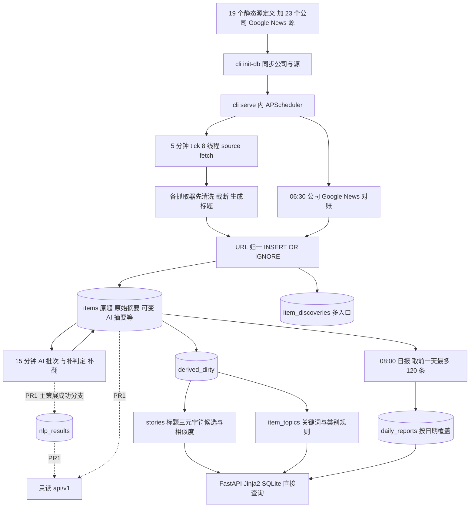

# InfoHub 当前架构审计

日期：2026-09-14（UTC）。审查对象：`main@88a2a1ef16e5`；PR #1 `b18d08130fe2`；独立部署管理器 `1f12177`。严重度指相对于未来生产集成的优先级，不表示已发生安全事故。

## 1. 结论

当前系统是能运行的个人新闻聚合与阅读工具，已有来源容错、URL 去重、中文策展、多主题、持久报道集合、日报、搜索和私网部署。FastAPI + Jinja2 + SQLite 对当前体量仍合理。

问题集中在三条边界：**内容与分析结果混存、报道分组与事实事件混用、代码更新与生产发布混用。** 未来作为 NLP 情报模块，需要先修正这些边界，再增加情绪标签、宏观图表或更多模型。

不建议全站推倒重写；也不建议把 PR #1 原样合并为“稳定 NLP 底座”。现有数据不可恢复的部分必须诚实保留缺失标记。

## 2. 证据与实际运行状态

| 检查 | 本轮结果 | 能证明与不能证明 |
|---|---|---|
| Git main | `88a2a1ef16e5` | 当前远端与本地 main 一致 |
| PR #1 | OPEN，`b18d08130fe2`，Python 3.11/3.12 与 Docker CI 成功 | 未合并；CI 不是语义评估 |
| Windows `/api/health` | 在线版本 `88a2a1ef16e5`；42 个启用源；约 1.1 万条；status=ok | 该版本响应 HTTP；不是硬件/备份/模型质量证明 |
| Windows 页面 | 首页、主题、OpenAI 主题、热点、日报、搜索、收藏、健康返回 200 | 本轮是 HTTP 冒烟，未重跑移动端视觉/交互测试 |
| Windows `/api/v1/items` | 404 | PR #1 API 尚未部署 |
| Mac 本地 `/api/health` | 404；发现 9 月 13 日启动的 `cli.py serve` 进程 | 存在旧常驻采集进程，不能把 Mac localhost 当 Windows 服务 |
| SSH | BatchMode 认证失败 | 未读取 Windows 文件、容器实际配置与自动部署日志 |
| 本地测试 | main 43/43；PR #1 46/46 | 临时库与 mock，无付费模型调用，无外部新闻重抓 |
| 迁移正常路径 | 两份本地库副本重复 init；原业务表行数与全行哈希一致；FK/完整性/FTS 检查通过 | 不等于新目标迁移已完成；不是最新 Windows 数据快照 |
| 迁移故障注入 | `_apply_migrations` 后半失败后前半 DDL 仍存在、版本记录 0 条 | PR #1 不能保证宣称的迁移原子性 |
| GitHub main 保护 | `protected=false`；rulesets 查询 403 | 无可核实的规则保障；管理器自身也不检查 CI |

精确时间与结果保存在 [证据目录](evidence/README.md)，在线数据会继续增长。

### 2.1 数据画像（仅本地快照）

`app.db` 于 `2026-09-14T22:25:38Z` 经只读连接备份到内存后检查：

| 指标 | 数值 | 解释 |
|---|---:|---|
| 文档条目 | 11,050 | URL 去重粒度，不是独立事件数量 |
| 原始摘要 NULL | 3,302 / 29.88% | 历史未保留，不能从 AI 摘要反推 |
| 原始摘要空串 | 3,535 / 31.99% | 主要包括 Google News 标题型材料，不能误称丢失正文 |
| 原始摘要非空 | 4,213 / 38.13% | 仍可能只有 400 字截断或公告元数据生成文本，不等于全文 |
| 股票频道 | 9,898 / 89.57% | 来源与关注公司配置产生的样本结构，不代表全市场分布 |
| 活跃 stories | 6,750 | 相似标题的当前报道集合 |
| 单篇 stories | 5,765 / 85.41% 的活跃 stories | 不能据此计算归并召回率；没有标注真值 |
| 多发布方 stories | 788 | 发布方数量不代表独立证据数量 |
| 无 discovery 记录 | 1,333 | 历史记录比 discovery 表更早，不自动视为新采集失败 |
| 隐藏条目中的宏观关键词候选 | 116 | “美联储/通胀/利率/非农/CPI”的粗筛，未经逐条人工确认 |
| JSON/公司关系/时间格式异常 | 本次规则下均 0 | 结构一致，不意味着公司识别和新闻事实都正确 |
| SQLite integrity / FK | ok / 0 违例 | 当前样本库结构完整 |

另一份 `app.windows-migration.db` 文件为本地早先迁移文件，共 10,241 条、最晚入库 `17:17:22Z`。文件名不能证明它等于现在的 Windows 生产库。本轮两库都只对临时副本执行迁移。

## 3. 当前真实数据流

- 原始 HTTP 响应不保存；RSS/快讯通常先截断为 400 字，Google News 摘要为空，SEC/HKEX 多为程序生成的公告元数据描述。
- source 赋单频道，`items.url` 全库唯一，重复 URL 只补关联/发现记录，不更新正文。
- AI 输入主策展只取 200 字；成功输出覆盖 `summary/title_zh/score/tmt/reason/ai_cat`。补处理走另外两条模型路径。
- 事件窗口 72 小时、标题匹配阈值 0.72、最多 120 候选。先按三元字符找候选，再比较原题/译题；数字、公司、官方公告边界有保护。
- `story_items.item_id` 是主键，一条文档只能归属一个 story；matcher 版本存在 `match_reason` 中。
- 派生刷新用 `BEGIN IMMEDIATE` 串行写锁，将整批匹配计算和关系写入放在同一事务。
- cron 在内存中重建；日报和对账不是持久任务。进程重启后没有逐个检查漏掉的日期/轮次。
- Docker 单容器 `python cli.py serve`；没有运行时身份认证；端口 `8000:8000` 发布到宿主机，实际访问范围取决于 Windows 防火墙。

## 4. 主要问题与修复方向

代码位置按模块和函数列出，读者可在 [main 固定提交](https://github.com/jiangbosong123-netizen/infohub/tree/88a2a1ef16e521b03b0a12170f11f43a3ab0a2a3) 与 [PR #1](https://github.com/jiangbosong123-netizen/infohub/pull/1) 核对。

| ID / 优先级 | 证据与问题 | 影响 | 最小设计修正 |
|---|---|---|---|
| A01 / P0 集成前 | `ai/pipeline.py:SYSTEM_PROMPT/_call_llm_tmt` 明确排除宏观/地缘；routes/API 全局过滤 `tmt=0` | 宏观分析先丢了输入，样本被科技筛选偏置 | 保存、研究相关性、展示策略三层分开 |
| A02 / P0 分析前 | `rss_source.py:_clean_html` 截断；runner 只有 raw_summary；SEC/HKEX 的 summary 是程序生成 | 无法验证原文、数字和完整上下文 | 原始记录+内容版本+证据类型；历史缺失显式标注 |
| A03 / P1 | `runner.insert_item` 同 URL 只补公司，不更新标题/正文/发布时间 | 新闻纠正永远无法进入系统；URL 复用误视为同文 | 按来源外部 ID 和内容哈希追加版本，记录 URL 别名 |
| A04 / P0 时序分析前 | 缺失/未来时间被替换成 now，原时间与修正原因丢失；HKEX 使用可变 APP_TZ 解析来源时间 | 把旧稿/错误日期当新消息；换展示时区可能改公告时间 | 来源时区独立；时间原值/精度/状态/首次可知时间并存 |
| A05 / P1 | `company_match` 人物/产品/宽泛词直接等于公司；company 双存 JSON 与关系；watchlist 移除公司不会停用 | 错误公司关联又触发 `_keep_tmt` 保留；源与主题难退出 | 实体类型、别名歧义、提及/影响分开，软停用，单一关系真值 |
| A06 / P1 | 单 source 频道；`upsert_sources` 改 source 频道批改历史 | 编辑采集配置改写内容语义/事件归属 | source 提供候选，不充当领域分类真值 |
| A07 / P1 | `topics.assign_topics` 删除旧归类；按关键词和 AI 类别分类，无历史规则版本 | 无法解释过去为什么属于某主题；模型类别可形成推断循环 | 版本化分类断言，证据类型/方法/规则版本齐全 |
| A08 / P0 事件分析前 | `stories` 只有标题/代表文档/报道计数；一文一 story | 无法表示多事件长文、跨月事件进展、冲突与修正 | 文档 M:N 事件，事件事实版本、事件关系、历史归属 |
| A09 / P1 | 标题相似度、72h、数字集合硬约束 | 同事不同写法漏并；金额更新可拆开；同时间同模板仍可能误并 | 保留规则作基线，标注样本评估候选召回与复核；不直接降低阈值 |
| A10 / P1 | `_refresh_stats` 以已知 publisher 数加热；selected_clause ≥2 可精选 | 转载/聚合可强化热点，未证明独立证据 | 发布方与原始出处分离，独立性 unknown，不把多媒体自动当 corroborated |
| A11 / P0 审计前 | PR1 `audit.save_result` 唯一键+UPSERT 覆盖同版本结果 | 模型换了、同模型再跑后旧结果消失；不能审计 | 每次 attempt 与不可变 result，模型/提示/输入哈希齐全 |
| A12 / P1 | PR1 只审计主策展成功；标题/TMT 补处理、拒判/失败、日报无记录 | 当前页面与档案可能不同；成本/失败不可追 | 一个分析执行与发布通道，完整任务状态与投影指针 |
| A13 / P0 影响前 | score 是“重要性”，reason 由 ≤200 字素材生成；没有句级证据/影响对象/验证 | 易将编辑分误当置信度、文本情绪误当价格影响 | tone/impact 分型，证据门槛、对象/方面/期限、未知值 |
| A14 / P1 | `score=NULL/-1`、`title_zh='-'` 混作队列状态；无租约/预算/重试次数 | 多进程重复调用、失败长留、拒判被误隐藏 | durable jobs、attempt、重试预算、拒判与相关性独立 |
| A15 / P0 迁移前 | schema 分散于 SCHEMA、ALTER、DERIVED_SCHEMA、executescript 和 MIGRATIONS；无前向未知版本拒绝 | 部分 DDL 留存，未来版本库可被旧程序改动 | 显式事务+checksum+基线检测+版本兼容范围+独立迁移命令 |
| A16 / P0 消费者接入前 | PR1 since/pagination 用 published_at；story 用可变 last_at；无删除/重定向变化事件 | 迟到文档、重分析、撤回、事件合并不能可靠同步 | 浏览游标和 change_seq 分开，快照交接、tombstone、dataset epoch |
| A17 / P1 | PR1 无 response_model；200 OpenAPI schema `{}`；无 auth、rate limit；缺 story 单项/证据接口 | “v1”名称不能保证契约稳定；共享私网权限过粗 | 发布前定义 DTO/错误/权限/时间/枚举，契约测试 |
| A18 / P1 | `daily_reports` 日期唯一且覆盖；素材前 120 条；未存输入/模型/截止时间 | 不可重现，低量频道可能饿死，历史结果引入后见信息 | 报告版本、素材清单、as-of、覆盖与缺失说明 |
| A19 / P1 | `cli.serve` 内存调度；`max_instances=1` 仅限该 scheduler；裸 uvicorn 没有抓取 | 重启错过任务不补偿，多实例重复；长模型调用拖积压 | web/worker 分工+持久任务+租约+启动补偿 |
| A20 / P1 | `refresh_derived` 一次取完 dirty、事务内计算、配置变更全库入队 | 随规模增长长写锁、采集阻塞、启动变慢 | 事务外计算+输入版本检查+有界提交与索引版本切换 |
| A21 / P1 | fastnews/sina 对 `{}` 默认空列表；RSS 有 HTML 空页也可能返回 []；SEC 缺 filings 可空成功 | 源协议变化呈现“没有新闻”，健康仍绿 | 响应 schema 与有效空结果分开；source 子任务与拒绝计数 |
| A22 / P1 | source 再加入 `upsert_sources` 不更新 enabled；对账与定时同 Google 上游 | 删除再添加后可能仍不抓；对账不是独立完整性证据 | 显式启停规则；覆盖分母与独立样本，展示有限窗口 |
| A23 / P0 发布前 | manager 先 pull 再 build，HEAD==remote 时提前返回 | build 失败后下轮不重试；“已拉取”误等于已部署 | desired/built/deployed/healthy 四态，部署成功 SHA 单独存 |
| A24 / P0 发布前 | manager 不限定 main、不校验 CI、不备份、不等 readiness、不回滚；自动与手动无共用锁 | 功能分支/失败提交可部署，迁移风险无法拦住 | 每项目部署清单、提交校验、互斥、迁移门禁、健康验收 |
| A25 / P1 | `/api/health` 只由源 issues 决定 status；never 不计；AI/队列/日报不参与；Docker 只检查 HTTP 200 | 网站看似健康但任务停滞；unhealthy 本身不保证重启 | liveness/readiness/pipeline 分开，心跳与队龄、明确发布判断 |
| A26 / P1 | 依赖大多只有下限；Docker 基础镜像浮动、root 用户、无资源/日志上限 | 同一提交不同时间产物不同、多系统资源争用 | 锁依赖和镜像，非 root，资源限额与日志轮转，保留可回滚产物 |
| A27 / P1 | Docker Desktop 与 watcher 依赖 serveradmin 登录；Mac 旧进程仍采集；DB 固定路径 | “长期运行”不等于重启无登录恢复；开发/生产混淆 | 环境标识、独立 DB 路径、默认禁采集；实测重启、锁屏、注销差异 |
| A28 / P2 | topic selected 数按条目统计、展示按事件去重；两篇同事件显示精选 2、列表 1 | 用户无法理解数字；搜索最多 100 条无分页 | 定义统计粒度、查询状态与分页；事件入口优先 |
| A29 / P2 | 收藏 localStorage 按 origin 隔离，最多保留 200；`.save-button/.is-read` 无专用样式；只在点外链标已读 | Mac/Win、localhost/IP 看到的状态不同；已读可能没有明显反馈 | 明确存储边界；先修交互样式，再按需求加入账户同步 |
| A30 / P2 | README 描述自动刷新、Mac 推荐常驻、滚动更新、模型已启用等与当前机制不符 | 运维与用户形成错误模型 | 本 SPEC 替代旧基线；README 只描述已验证能力 |
| A31 / P0 历史分析前 | SEC `_parse_ts`对naive输入调用astimezone；RSS `_to_iso`用updated回退published；HKEX源时间依赖APP_TZ | 同一SEC输入随宿主时区不同；RSS更新被标成发布；跨机重放不可比 | 保存时间原值/角色，来源独立时区和规则版本；缺值不填now；DST固定案例 |
| A32 / P1 美股语义前 | US13关注公司；单market；SEC只取recent[:40]且只保留form/cik，部分6-K/20-F/修订类型描述通用 | 已有美股消息但无全市场覆盖保证；接受/申报日/公开时间与报告期难追溯 | 发行人/证券/上市关系分开；保留SEC原record、accession、各时间；明确覆盖和回补上限 |
| A33 / P0 严格历史前 | 现有库无可信可见检查点/时钟证据，旧fetched_at在批量插入时生成；SPEC初稿available_at描述也过强 | 应用写入时间不能单独证明物理提交与消费者收到的时间 | available_at定义为事务记录时间，严格PIT另需已提交H检查点/时钟证据；消费者自行记录接收 |

### 4.1 证据可重复性与限制

[probes.py](evidence/probes.py) 使用临时库复现 A03/A11/A15/A16/A17/A21/A22/A25/A28。输出见 [probes.json](evidence/probes.json)。例如连续保存 `model-a:10` 和 `model-b:90`，表里只剩后一条；故障迁移留下表但没有版本记录。

本轮补查美股与时间：本地另一采样时点有4,913个不同item关联13家US公司（未逐条核实）；已含6-K/20-F。SEC合成naive输入在UTC/上海/纽约分别得到16:05/08:05/20:05 UTC，显式Z输入则相同；仅updated的RSS被返回为publication。见[补查脚本](evidence/us_time_review.py)与[结果](evidence/us-time-review.json)。这证明解析分支缺陷，不证明全部生产输入均无时区或全部SEC数据错时。

A23 是依据管理器控制流推导的确定性缺陷，本轮没有在 Windows 上故意制造失败。A09 的语义准确率/A10 的独立来源数还没有人工真值；本轮不把这些风险表述成已测误差率。A26 不表示已经发生资源耗尽或权限事故。

测试本身的缺口：辅助 `item(...score=40)` 把 score 传入 raw，但 `insert_item` 忽略 raw.score，因此部分名为“低分多源精选”的测试实际使用 NULL 分；应改成显式数据库/标准分析结果赋分。测试覆盖了基本规则，但没有故障重启、真实 Windows 恢复、时间点查询、来源格式漂移、人工标注语义评估和预算上限。

## 5. PR #1 明确处理意见

**结论：保留 OPEN 作为方案记录，不原样合并，也不在本次关闭。通过后续小 PR 替代；由所有者在替代完成后决定关闭。**

| 变更 | 保留 | 必须修改 | 推迟/替代 |
|---|---|---|---|
| `database.py` 迁移表 | 有序迁移与已应用记录的方向 | 显式 BEGIN/rollback、checksum、未知版本拒绝、旧库基线、失败注入 | 不让新增 `nlp_results` 先定义整个领域模型 |
| `ai/audit.py` | 记录输入/输出/模型的意图；调用与业务更新同事务方向 | 取消结果覆盖；attempt 与 result 分开；完整 prompt/provider/input/时间与错误 | 用新 audit 模块替代现 save_result 语义 |
| `pipeline.py` | 输出 ID/类型校验、离线回归样例 | 全部路径统一审计；保留模型原判与保留规则实际决策；输入快照、预算 | 不在旧 7 字段里直接加“利好/利空” |
| `web/api.py` | 只读、参数化、限页大小、批量 topic 加载 | typed DTO、认证、事件详情、null/缺失语义、变化流、快照、重定向 | v1 稳定承诺推迟到契约测试；内部试验不可供消费者长期依赖 |
| routes/health | 版本和档案状态可见 | 就绪与数据状态分离，旧 schema 的明确不兼容错误 | 不用结果总数代表分析覆盖率 |
| tests | 保留隔离临时库、游标/隐藏/接口回归作为素材 | 增加重分析、失败事务、迟到/更正/撤回、固定 as-of、鉴权测试 | mock 通过不作为 NLP 质量结论 |
| README / NLP_INTEGRATION | 大系统输入模块、事件对象与证据优先方向 | 本 SPEC 替代草案；标注 proposed/implemented | 删除“已稳定/每次保存”的过早承诺 |

## 6. 值得保留的实现

SQL 使用参数、数据库连接显式关闭、WAL/外键、写入去重竞争处理、发布方与采集入口初步分离、译题搜索、HTML 清洗、未知发布方不加票、旧事件重定向、增量 dirty 队列、新旧 AI 队列配额、抓取单源隔离、官方文件的误合并保护和 CI 都有价值。

这些应成为迁移回归基线，而不是因为目标数据模型变化就全部删除。新的规格只在证据充分、兼容验证完成后逐步替换其职责。
