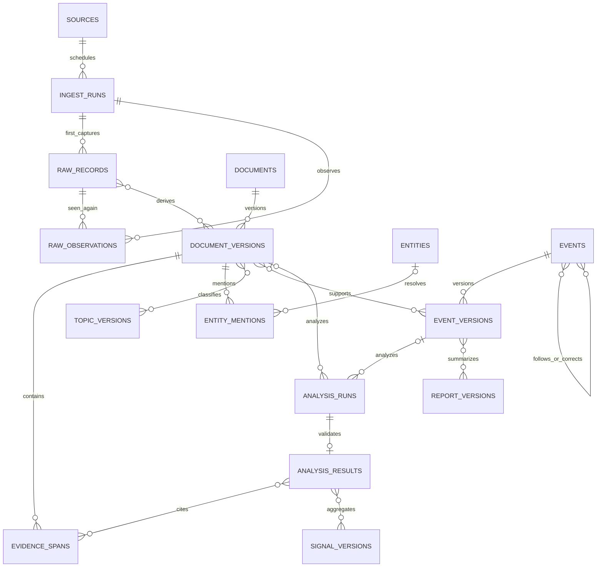

# 数据模型、身份与生命周期

状态：目标设计；现有结构见 [审计](AUDIT.md)。所有“新增表”按路线图分批实施，不一次建完。关系库继续使用 SQLite，模型不依赖 SQLite 专属 ID 或隐含行顺序。

## 1. 身份、时间、版本的统一规则

### 1.1 ID

- 新对象使用服务端生成的 UUID 字符串；ID 与标题、URL、模型、外部 ticker 无关。事件迁移保留原 story 的 32 位 UUID，API 按不透明字符串处理。
- `dataset_id` 是数据集永久 UUID；从已有生产库迁移时创建一次并随备份保留。开发复制库使用独立环境标识并阻止写入生产消费者。
- `dataset_epoch` 是同步世代号；正常重启/部署不变。恢复旧快照导致 change_seq 回退时必须产生新 epoch，迫使消费者重建快照。
- 旧整数 item ID 用 `legacy_item_id UNIQUE` 保存；`(dataset_id,legacy_item_id)` 确定映射。禁止按标题重造 ID，也禁止让 Mac 和 Windows 的同号记录被当成同一个事实。
- URL 是可变 locator；canonical URL 用于候选去重，来源 external ID 优先但需限定 source namespace。更正与跨站转载不靠 URL 单字段解释。

### 1.2 时间

持久化可比较时间统一为 UTC、固定微秒精度 `YYYY-MM-DDTHH:mm:ss.ffffffZ`（迁移前旧 `+00:00` 格式保留在 legacy 投影，目标表统一规范）。API RFC3339，必须带时区。日/月只有精度区间，不能自动补成精确时间。

| 字段 | 定义与约束 |
|---|---|
| `source_published_raw` | 来源提供的原始值，字符串/原字段路径；不可覆盖 |
| `published_at` | 解析成功的发布时间，可 NULL；不能用抓取时间冒充 |
| `published_precision` | instant/minute/day/month/unknown |
| `source_timezone` | 来源规则，如 HKEX 使用 Asia/Hong_Kong；与用户展示时区无关 |
| `time_status` | parsed/missing/invalid/future_suspect/legacy_unverified |
| `observed_at` | 系统取得该原始记录的时间，服务端记录 |
| `first_seen_at` | 文档/事件第一次进入本数据集的时间，后续补录不提前 |
| `event_time_start/end` | 事实发生/生效区间；与报道发布时间不同；未知可空 |
| `available_at` | 当前版本在本系统提交并可供消费的时间；历史可知性依据 |
| `analyzed_at` | 模型/规则完成时间，不等于事件发生时间 |
| `as_of` | 报告/信号选材的系统知识截止时间 |

未来时间超前超过来源容差（默认 10 分钟）记 `future_suspect`，保留原值；展示排序暂用 first_seen_at 并说明，不改原发布时间。时钟错误属于运维告警。获取事件起止/有效期时保留来源时区和精度。

历史回测读取必须满足：输入文档版本、事件关系版本、分析结果的 `available_at <= as_of`。今天重新分析去年新闻，得到的是“今天回看”，不能写入去年的可交易信号序列。当前 legacy 没有这些完整时间，默认 `point_in_time_eligible=false`。

### 1.3 版本及不可变内容

- 一次版本发布同时写不可变内容、来源引用和变化日志，再更新当前投影指针；事务要么全部成功，要么全部回滚。
- 原始内容、版本载荷、分析结果不可 UPDATE；修正创建新版本，用 `supersedes_id` 连接。仅任务状态、lease、缓存与当前指针可变。
- 同一个逻辑输出允许多次 attempt；若输入/代码/提示/配置相同且已有有效结果，默认幂等复用。显式重跑产生新 attempt/result，不覆盖旧结果。
- 内容哈希使用 UTF-8 字节 SHA-256，规范化 JSON 使用固定排序/数值/空值规则并注明算法版本。原始字节 hash 和清洗文本 hash 分开。

## 2. 核心关系

图中的M:N必须有关系表或不可变快照内的显式引用；具体如下。文档/事件分析主对象二选一，不可同时必填；report任务以固定report输入manifest为主对象。上下文可引用多个版本。未解析的mention允许entity为空。图省略了publication/review/current指针，不能据此省去下文定义的历史表。

## 3. 采集与文档层（R1-R2）

### 3.1 sources / source_config_versions

保留现有 sources ID/key 与健康数据。扩展 `enabled` 的明确状态、source owner、来源类型、允许域名、默认时区、外部 ID 规则、频率、请求上限、内容大小、许可/保留策略、完整性能力。

`source_config_versions(id,source_id,version,config_json,config_hash,available_at)` 不可变；每次 ingest_run 引用实际版本。配置不含 API key 值，只有 secret reference。源配置改变不自动改历史分类；需要分类重跑时单独建任务。

采集完整性能力取 `cursor_backfill / bounded_window / snapshot_only / unknown`。必须记录分页、水位、重叠窗口、已知上限和可恢复区间；不能把 50 条 RSS 叫无限增量。

### 3.2 ingest_runs

字段：`id,source_id,config_version_id,scheduled_for,started_at,finished_at,status,request_count,raw_count,accepted_count,duplicate_count,rejected_count,bytes,watermark_before,watermark_after,error_code,trace_id`。

状态：queued/running/succeeded/partial/failed/skipped。SEC/HKEX 每公司子任务有 `parent_run_id,entity_id`，子任务结果独立；没有公司数据、有效空响应、缺失响应字段、抓取失败分别计数。watermark 只在原始记录持久化成功后前进，分页中途失败从已提交水位继续。

### 3.3 raw_records 与原始对象

一条 raw_record 表示一次内容观察中的去重载荷：`id,ingest_run_id,source_id,external_id,observed_at,request_url,final_url,http_status,selected_headers,media_type,encoding,payload_sha256,payload_ref,payload_kind,truncated,size_bytes,retention_class`。

- `payload_kind`: feed_entry / api_record / html / pdf / legacy_excerpt / generated_metadata。
- 保存被解析的原始 entry/record；若只留全响应，必须记录 entry 的 JSONPath/XML selector/byte offset，确保可重放。
- 原始字节存储于持久化 volume 的按哈希路径；临时文件写完并 fsync、原子重命名后，事务写数据库引用。事务失败留下的无引用对象可由 GC 在 7 天保护期后清理。
- 同一 source/external_id/payload hash 的重复观察不复制内容；在 `raw_observations(raw_record_id,ingest_run_id,observed_at)` 追加出现记录（可按保留策略压缩计数）。首次与最近看到是派生值，不改证据时间。
- 响应大小、MIME、压缩比、PDF 页数与总处理时长有上限；超限返回 rejected/truncated 状态，不无声截断。
- 禁止保存授权请求头、Cookie、URL 中的秘密参数。对象存储路径不对普通 API 暴露。

### 3.4 documents / document_versions

`documents`: `id,dataset_id,legacy_item_id,kind,first_seen_at,current_version_id,status`。

`kind`: article / flash / filing / policy_release / research / commentary / transcript / other；`status`: active / withdrawn / restricted / duplicate_alias。

`document_versions`: `id,document_id,version,previous_version_id,normalizer_version,title_original,language,text,content_sha256,canonical_url,publisher_id,published_at,...时间字段,content_quality,available_at`。

关键唯一约束：`UNIQUE(document_id,version)`；版本 ID 全局唯一；`current_version_id` 必须属于同一个 document。`content_quality` 有固定 schema：`origin`（publisher_text/feed_excerpt/generated_metadata/legacy_unknown）、`extent`（full/excerpt/title_only/none）、`truncated`、`extraction_status`。原始 record 到文档版本用 `document_version_inputs(version_id,raw_record_id,role)`，其中 role=primary/metadata/additional。

`document_locators(document_id,url,source_id,external_id,first_observed_at,last_observed_at,relation)` 管地址和外部身份；relation=canonical/mirror/redirect/source_alias。可含查询参数的合法 URL 不一概删除，只移除已确认的 tracking 参数。HTTP→HTTPS、大小写路径与不同查询参数是否同文由来源规则决定。

更正同一 URL 时新增版本；同正文不同 URL 先标 duplicate/mirror 候选；不同媒体引用同公告仍保留各自文档，不能因为同一事件就删除文本。URL 重新用于不同出版物时创建新 document 并保留旧 locator 生效区间。

### 3.5 evidence_spans

字段：`id,document_version_id,kind,field,start_offset,end_offset,quote,quote_sha256,locator_json,available_at`。

- 文本片段按该版本清洗文本的 Unicode code point、左闭右开区间定位，必须满足 `text[start:end] == quote`。原始 PDF 附页码/段落/bbox（若可用）；HTML 附 locator；同时保留抽取器版本。
- `kind=source_text/source_title/source_metadata`。程序生成的 SEC 摘要必须标 `content_quality.origin=generated_metadata`，证据只能指向真实取得的 `source_metadata` 字段，禁止包装为发行人原话；元数据字段以 JSON pointer + value 定位。
- 翻译不能替换原文引用；可保存独立译文分析并连接原证据。
- 证据无法访问时明确 `missing/restricted/expired`，仍保留引用元数据与 hash；失去必要证据的分析降为不可验证，API 不静默返回空证据。

## 4. 实体、发布方与主题（R2）

### 4.1 entities / entity_identifiers / entity_aliases / entity_relations

实体字段：`id,type,canonical_name,status,created_at,current_version`；type 包含 organization/person/product/model/industry/region/macro_concept。实体名称与类型修正有版本快照和 available_at。

标识字段：`entity_id,namespace,value,valid_from,valid_to,evidence_id`。namespace 示例 cik/lei/exchange_ticker/hk_stock_code/external_system。ticker 必须有交易所与有效区间；一个公司可多证券、多市场，不能用现有 `market` 单值表示全部上市身份。

别名：`entity_id,alias,language,match_mode,ambiguity,status,evidence_id,valid_from/to`。人名、产品名不存为公司的确定性别名；用 `entity_relations(from_entity,to_entity,relation,valid_from/to,evidence_id,available_at)` 表示任职/隶属。歧义别名只能生成候选。

`entity_mentions(id,document_version_id,entity_id,evidence_id,method,method_version,raw_confidence,calibration_version,status)`。NULL entity_id 表示 unresolved，不强行分配；`mentioned` 不等于 `affected`。影响关系来自独立 analysis。

### 4.2 publishers

发布方使用独立稳定 ID，可关联 organization entity；域名/别名维护来源与生效时间。source（入口）、publisher（刊登者）、origin（声称引用的出处）、primary_actor（事件当事方）是四个角色。

`document_attributions(document_version_id,publisher_id,origin_document_id,relation,evidence_id,method,status)`：original/syndicated/cites/unknown。多个域名刊登同一通讯社稿件，保留各 publisher，但独立证据集合归同 origin group。无法确定独立性时返回 NULL/unknown，不能按域名数“推定独立”。

官方状态针对本事件中的角色：公司自己发布的公告是其行为的一手材料，不是对同行断言的独立证明；SEC/HKEX 是披露载体，并非为每条发行人陈述提供事实背书。

### 4.3 topics / topic_versions / topic_assignments

保留现有 topic slug 外部链接；新增稳定 topic_id，slug 可有 alias。主题类别 company_model/technology/format/macro/research；公司与模型分别引用实体，可在页面归一组。

`topic_versions(id,topic_id,version,name,description,rules_json,rules_hash,status,available_at)`。

文档归类 `document_topic_assignments(id,document_version_id,topic_version_id,method,analysis_result_id,evidence_ids,status,available_at)`；同一对象/规则版本有效断言唯一。事件版本中的主题引用固定 topic_version_id，不随配置改动漂移。

规则匹配保存命中片段而不只有命中词；模型匹配保存原模型结果、输入版本与验证状态。人工更正覆盖当前投影但保留旧断言。配置变动建立 reclassification job，历史标签在新投影发布前仍可查询。

## 5. 事件层（R2）

### 5.1 events / event_versions

`events(id,first_seen_at,current_version_id,status)`；状态 candidate/active/resolved/retracted/merged/split。`resolved` 表示过程已结束，不能表示“真实性已被证明”。

`event_versions(id,event_id,version,previous_version_id,schema_version,title,event_type,event_time_start/end,time_precision,primary_entities,object_entities,facts_json,topics_json,knowledge_status,available_at,created_by,method_version)`。

事件类型从产品领域定义，与原 source.channel 解耦；第一版类型集合：model_release/product_update/research_result/earnings/financing/ma/personnel/buyback/regulation/litigation/macro_release/monetary_policy/other。

`knowledge_status`: reported/corroborated/disputed/confirmed_by_primary/retracted/unknown。单个事件可包含相互矛盾的 facts；“官方确认”必须指明确认了哪个事实及谁确认，不能覆盖全部事件。

`facts_json` 是受 JSON schema 管理的数组：每项 `fact_id,subject_ids,predicate,object/value,unit/currency,period,time_interval,modality,evidence_ids,conflict_group`。modality=asserted/announced/planned/estimated/denied/corrected。数值事实同时保存原单位/币种与标准化值；未知单位不自行猜测。

`event_evidence(event_version_id,document_version_id,evidence_id,fact_id,role)`；role=supports/contradicts/context。验证 fact_id 必须在该版本载荷中，evidence 必须属于指定文档版本；这一跨 JSON 约束由发布事务校验和完整性检查共同保证。事件版本不能仅引用可变“当前文档”。

### 5.2 关联与进展

`document_event_links(id,document_version_id,event_id,event_version_id,role,decision_id,available_at,supersedes_link_id)`，允许多对多。一个财报长文可支持多个事件；同文重复采集不会生成新链接。

`event_relations(id,from_event_id,to_event_id,relation,evidence_ids,available_at,supersedes_relation_id)`：follows/implements/corrects/denies/related_to。关系必须校验无自环；时间线允许长于 72 小时。同一并购的“签约”和“监管批准”分别是事件，通过关系呈现事项脉络。

不把任意相似报道作为事件新版本。新报道只有引用来源增加而无事实变化时，更新证据/关系版本与 coverage，`latest_report_at` 变化，`last_fact_change_at` 不变。界面分别展示两者。

### 5.3 三层去重与合并策略

1. **采集观察重复**：相同入口和内容 hash，记录 observation，幂等。
2. **文档重复**：同一出版物的 URL alias/mirror，关联 document；转载保留各文档及来源链。
3. **事件相同**：依据主体、动作、对象、产品版本/财报期、时间和事实，合并证据，不消灭文档。

候选检索先用实体/时间/标题/关键词，现 titles-v3 保留作基线。embedding 仅在评估候选召回确有收益时加入，模型和索引版本登记；相似度不是事实概率。

不同模型版本、不同财报期、不同证券发行、否认与宣布不能仅凭标题相近直接合并。金额或时间变化可能是更正，需要比较事实与出处，而不是一律拒并或一律合并。

每次匹配保存 `match_decisions(id,input_versions,candidate_event_versions,matcher_version,features,score,decision,reason,review_status,available_at)`。自动阈值根据标注集设定，低于门槛创建 candidate 或送复核。人工已判“不合并”形成有版本约束，重跑不得无声覆盖。

### 5.4 合并、拆分、撤回

- 合并：保留 survivor ID；旧 ID 记 alias。追加变更记录和关联快照，迁移证据关系；API 返回 canonical_id，网页重定向。全图不得有循环。
- 拆分：原事件标 split，记录 replacement_ids；新建多个事件（或复用明确的存续事件），逐篇/逐证据分配。旧页显示拆分原因与去向，API 不能任意 301 到一个子事件。
- 撤回：保留历史与原因、撤回证据、当前标记；普通列表可隐藏，但变化流必须发 tombstone/status change。
- 文档被撤回不等于事件不存在。重新计算当前证据是否足够，将依赖分析标 stale，安排重新评估。
- legacy story 在迁移时标 `candidate`，不得把标题相似自动升级成语义已确认事件；保持当前网页可读直到新投影验收。

## 6. 分析、复核、报告与变化流

### 6.1 analysis_runs / analysis_results / analysis_inputs

`analysis_runs` 保存 job_id、attempt、主对象版本、task_type、provider、requested_model、resolved_model（若返回）、prompt_template_id/hash、渲染后输入 hash/ref、pipeline_version、parameters、started/finished、status、错误、token、费用估计及计价版本。

`analysis_inputs(run_id,document_version_id,event_version_id,evidence_id,role)`至少一个明确输入；同一行引用按role校验。主对象通过subject_type/subject_version_id表示document/event/report之一，应用发布事务验证引用存在且类型正确；report主对象指向模型调用前创建的`report_input_snapshots(id,report_key,as_of,input_manifest,manifest_hash,available_at)`。其后生成的report_versions引用该输入快照，不形成“先有报告输出才能调用报告模型”的循环。

`analysis_results(id,run_id UNIQUE,schema_version,raw_output_ref,validated_output_json,validation_report,created_at,available_at,supersedes_result_id)` 不可变。provider response 原样受限保存，允许解析后的结果与原输出不同，但必须记录 normalize/reject 原因。

`analysis_publication_versions(id,subject_version,task_type,result_id,version,review_status,evidence_status,available_at,supersedes_id)` 追加保存每次发布/复核/撤回决策，长期保留；`analysis_publications(subject_version,task_type,current_publication_id)` 仅为当前指针。不能依赖只有90天保留期的change_log重建全部历史。若新结果差于旧结果可不发布，仍保留 attempt。新输入版本出现时旧分析保持可查并标 stale，不冒充对新事实的分析；stale依据查询时点有效的对象版本与撤回记录计算。

分析具体字段、置信度与质量门槛见 [NLP 分册](NLP_AND_EVALUATION.md)。

### 6.2 review_actions

`id,actor_id,object_type,object_id,expected_version,operation,before_ref,after_ref,reason,evidence_ids,created_at,reverts_action_id`。

复核通过单一应用服务写入，强制乐观锁；版本过期返回冲突。所有人工修正通过新版本与 publication 覆盖当前结果，原模型输出仍保留。撤销追加反向 action，不删除历史。人工修改不是训练真值，经过独立复核才能进入评估集。

### 6.3 report_versions / signal_versions

报告：固定 date/时区/as_of、输入文档/事件/分析 ID 清单、版本、生成模式、引用映射、数据覆盖、模型元数据。`UNIQUE(report_key,version)`；date 不再单一内容主键。

信号：固定对象/方面/期限、窗口、formula_version、analysis_version_group、as_of、input_manifest、样本数量/覆盖/质量、结果、available_at。新增迟到材料产生重述版本，不能覆盖旧值。主系统若需要宏观统计真值，按外部稳定 ID 关联，不从新闻热度推造数值。

### 6.4 change_log 与快照

`change_log(seq INTEGER PRIMARY KEY AUTOINCREMENT,dataset_id,epoch,resource_type,resource_id,version_id,operation,available_at,payload_json,payload_sha256)`。

- 每次对外可见变化与对象版本在同一事务提交；payload 是当时的 API 投影快照或对应不可变版本引用，不能事后读取“最新对象”冒充当时变化。
- seq 是提交顺序的单调位置，可有空号，不允许复用；snapshot 与 changes 共用 epoch。
- 关系合并/拆分、分析发布、权限撤回、删除标记均有变化事件。只改标题、AI 分数也必须被消费者发现。
- 权限过滤后序列可能有间隙，消费者不得假设每个整数都可见；cursor 绑定身份权限版本，权限变化时重做 snapshot。
- 保留 changes ≥90 天；过期返回 410 + snapshot_required。首期 snapshot 保留 24 小时，明确 expires_at。
- 日常恢复同一最新一致性备份且不导致对外序列倒退时可保 epoch；其他恢复必须重新生成 epoch，不能假装无损续传。

## 7. 持久任务（R1）

`jobs(id,kind,subject_id,input_version,idempotency_key UNIQUE,state,priority,scheduled_for,lease_owner,lease_token,lease_expires_at,attempt_count,max_attempts,next_attempt_at,error_code,created_at,updated_at)`。

状态机：pending → running → succeeded / retry_wait / blocked / dead_letter / cancelled。阻塞原因包括预算、凭证和依赖；内容拒判是 attempt 结果，不等于非相关标签。任务幂等键由任务种类、对象版本、pipeline/prompt/config hash 构成；job attempt 追加记录。

worker 在短事务抢占租约，事务外网络/计算，提交前核对 lease_token 与输入版本。过期 worker 不得发布结果；可保留其迟到 attempt 供费用审计。外部调用无法保证 exactly-once，内部发布必须幂等。

## 8. 索引、事务和缓存

优先索引：文档 `(first_seen_at,id)`、版本 `(document_id,version)`、事件版本 `(event_id,version)`、实体/主题反向关系、job `(state,next_attempt_at,priority)`、change_log `(epoch,seq)`、分析 `(subject_version,task_type,available_at)`。

搜索索引保存文档版本/索引版本关系，原题、译题、实体别名、内容字段分开。SQLite FTS5 保留，短词查询使用受限制的 fallback；查询限制长度/返回页数/超时。索引可以重建，原始证据和稳定 ID 不可依赖索引存在。

首次 backfill 按主键 500 条一批（可调整，但记录配置）；在事务外计算，提交事务 p95 目标 <200ms。规则全量重建形成新 generation，完整性通过后切指针；暂停/崩溃从 checkpoint 继续，不在 web 启动里扫描全部历史。

缓存带对象版本与权限键，最多滞后 60 秒；`as_of` 查询不返回当前缓存。跨阶段的 eventual consistency 必须由 `processing_state/stale/as_of` 对外可见。

## 9. 旧表迁移映射

| 当前表/字段 | 目标 | 迁移约束 |
|---|---|---|
| sources / companies | 稳定 source + entity + legacy mapping | 保留旧 ID；公司移除改为停用；不假造历史有效期 |
| items.id/url | documents + locators + legacy_item_id | 每条映射唯一；重复候选以后复核，不在迁移时语义合并 |
| items.title/raw_summary/extra | legacy document version + raw_record | 明确 NULL/空/合成元数据；真实原始 HTTP 未保存即不可恢复 |
| items.summary/title_zh/score/... | legacy projection，必要时 legacy analysis import | producer/model/prompt=unknown；不伪造 run，不能用于时序评估 |
| item_discoveries | observations/locators 的迁移记录 | 缺 discovery 不创建虚假抓取；可记录 legacy first_source 已知关系 |
| item_companies / items.companies | 待复核 entity_mentions/legacy association | 不自动转换为 affected relation |
| topics/item_topics | topic_versions + legacy assignments | 旧匹配时间未知，不用迁移时间冒充当年分类时间 |
| stories/story_items | events candidate + version + membership | 保留 story ID、redirect 与成员；不在结构迁移中重算语义 |
| daily_reports | report_versions(mode=legacy_unknown) | 保留原日期、内容、时间；input manifest 未知 |
| clusters/cluster_members | 只读历史兼容 | 新模型切换稳定后再单独归档，不立即删除 |
| PR1 nlp_results（若发现） | legacy analysis records | 每行原样保留 hash；缺失覆盖历史不可恢复；不可认定生产已包含 |

切换期间 `items` 是旧页面兼容投影。新 pipeline 双写由同一事务完成，先比较后切读；禁止两套独立 worker 各自产生“真值”。迁移详情及回退见 [运维](OPERATIONS.md)。
