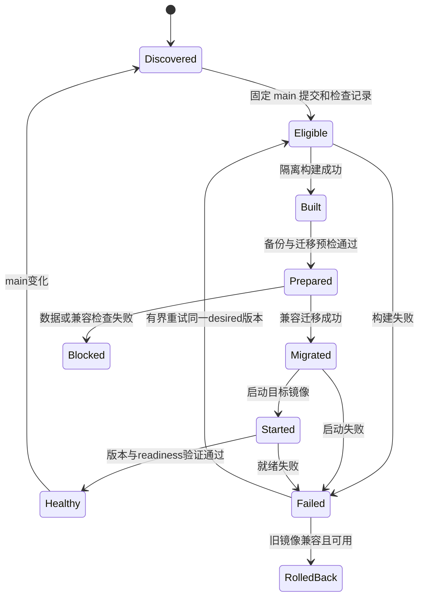

# 数据迁移、部署、安全与运维规范

状态：目标规范。本文没有执行生产迁移、重启、备份或账户调整。已验证项与未知项严格分开。

## 1. 当前生产边界

2026-09-14 UTC 的 HTTP 检查显示 Windows 的 `100.69.211.16:8000` 正运行 `88a2a1ef16e5`，约 1.1 万条记录、42 个启用源。主要页面返回 200，`/api/v1/items` 返回 404。Docker 容器、宿主机目录、任务计划和数据库实际文件内容没有在本轮远程读取。

目前已知部署方式：Mac 开发 → GitHub main → 独立 windows-server-manager 每 300 秒检查 → Windows Docker Compose；宿主机 `data/` 挂入容器，`cli.py serve` 同时启动 web 与采集任务。用户之前提供的 Windows 路径是 `C:\Users\serveradmin\Server\infohub`，仍需在迁移前现场核对。

Mac 本轮仍有旧 `cli.py serve` 进程，本地数据库仍增长。不能把 Mac 的 `app.db` 或早先 `app.windows-migration.db` 当成最新生产备份；开发、演练和生产必须分别标记。

### 1.1 Windows 长期运行的实际条件

- 插电时禁用睡眠/休眠；屏幕可关闭，不需要永不熄屏。笔记本合盖行为、散热、磁盘空间、网络恢复须在现场验证。
- Tailscale 无人值守、Windows OpenSSH 服务、Docker Desktop 登录后启动、管理器启动任务是不同层，不能用一个“开机启动”开关替代四项验证。
- 当前 Docker Desktop 方案不能仅凭勾选启动项承诺“断电重启后、任何用户未登录也恢复”。首期要求服务账户登录且会话保留；锁屏与注销不同。不可为了省一步而默认启用 Windows 明文自动登录。
- `restart: unless-stopped` 依赖 Docker 引擎已运行；手动停止的容器、应用 unhealthy 和引擎未启动有不同处理。健康检查变红不会自动等同于重启修复。[Docker restart policy](https://docs.docker.com/engine/containers/start-containers-automatically/)
- 真正无人登录的自动恢复如为硬要求，应单独选择可随主机启动的 Linux VM/服务方案并演练，不能在本次文档里宣称已经实现。无需现在重装 Windows。

## 2. 迁移安全承诺的边界

现有数据必须可迁移；方法是有证据的兼容迁移与停止条件，不是先写几条 ALTER TABLE 再口头保证安全。

本轮在两份**本地 SQLite 快照的副本**上运行 PR #1 初始化两次，原有逻辑表的行数/hash 未变，完整性、外键与 FTS 检查通过。另一个故障注入复现了其迁移中 DDL 残留问题。因此结论仅是“正常路径未损伤这两份本地副本”；目标 SPEC 的迁移尚未编写，最新 Windows 库尚未演练。

### 2.1 每次生产迁移前的必备证据

1. 采集生产 release hash、Python/SQLite/WSL/Docker 版本、DB 绝对路径、卷类型、大小、剩余空间、启用任务及最近成功备份。
2. 从实际生产库制作一致性快照；记录 schema SQL、表/索引/触发器、行数、逻辑摘要、最大 ID、FTS、`integrity_check` 与 `foreign_key_check`。
3. 用目标镜像在隔离卷运行迁移，核对保存性、历史链接、查询结果、暂停后恢复及中途失败。不得让演练容器连接真实来源或 paid LLM。
4. 在相同隔离副本测试“旧镜像读取升级库”的兼容路径，以及“新镜像不可用时”的恢复路径。
5. 写入迁移 manifest：输入快照 ID/hash、from/to schema、迁移 checksums、镜像 digest、耗时/峰值空间、旧版兼容范围、检查结果、操作者。
6. 只有全部通过才允许应用于在线库；未知 schema、备份未通过、空间不足、兼容性不明，部署器停在 blocked，继续服务旧版。

初始空间预算为现有 DB+WAL+本次新增对象大小的至少三倍可用空间，并另留两个镜像的空间；它是保守预检值，最终依据演练峰值和余量核定，不能拿磁盘总容量代替剩余容量。

### 2.2 正式迁移执行器

- 独立 `migrate` 命令；web/worker 启动只检查 schema 范围，不隐式建表、改列、导入目录或全量重建索引。
- `schema_migrations(version,name,checksum,applied_at,release_id)` 追加记录；拒绝已执行脚本 checksum 改动、版本空洞、数据库版本比程序新、未知 legacy 结构。
- 基线识别使用必需表/列/类型/约束及已知历史版本清单；允许经记录的已知兼容变体。不通过删除陌生列来“修好”检查。
- 所有 DDL/DML 与对应 migration marker 在同一个显式事务执行；连接先设好 FK 与超时，再 `BEGIN IMMEDIATE`，逐条执行受控语句，验证后提交；失败回滚。不要认为 Python 的 `with conn:` 自动给 DDL 开了事务，也不要在已开启事务中随意使用会隐式提交的 `executescript`。[Python sqlite3 事务行为](https://docs.python.org/3.12/library/sqlite3.html#transaction-control)
- 若操作无法事务化（如 VACUUM、外部对象搬运），作为独立可恢复步骤，有状态/校验/清理协议，不混称一笔原子迁移。
- schema 变更持有项目迁移锁并暂停所有 writers；读流量是否可保留由该次演练决定。禁止两个容器各自抢跑迁移。
- 大历史回填在 schema 迁移后独立运行：默认每批 500 条或 1 秒事务预算，记录 checkpoint/算法版本；可暂停、重跑和限速。批次不能由模型请求长度决定。
- 每次回填按唯一 legacy 映射幂等；崩溃后从最后已提交 checkpoint 恢复；同一批数据与 checkpoint 必须一同提交。

### 2.3 Expand → Backfill → Compare → Switch → Contract

| 步骤 | 生产做什么 | 允许回退 |
|---|---|---|
| Expand | 只增加目标表/索引/nullable 字段；旧表保持原语义 | 旧镜像继续使用旧表，新增表保留 |
| Dual-write | 唯一 ingest 服务在一笔事务写 legacy 与目标记录；共享 ID 映射 | 功能开关关闭新投影；不得丢新原始记录 |
| Backfill | 历史记录建立缺失状态和版本映射，不编造原文/模型审计 | 暂停回填；重跑幂等；不删除旧记录 |
| Compare | 同一快照对照文档数/事件链接/日期与过滤；每类差异解释 | 继续旧读路径，修复候选投影 |
| Switch | 单独 PR 切新读路径；旧兼容投影继续更新一个稳定发布周期 | 切回旧路径，旧投影须覆盖切换期间的新写入 |
| Contract | 至少 30 天稳定、下游迁移完成、备份恢复通过后才考虑删冗余 | 独立破坏性变更；不纳入首轮自动部署 |

Dual-write 必须由同一进程同一数据库事务完成，不能让两个独立采集器分别写新旧表。新领域不能表达为旧结构的部分（多事件、人工修正等）保留在新表；旧页面兼容呈现可简化，但不能影响新事实保存。

### 2.4 历史映射不可做的事

- `items.id` → 永久 legacy mapping；原 `stories.id` 和 redirect 保留，不批量重置。
- `raw_summary=NULL` 保持 missing；空串保持 observed_empty；无法判定是否人工/模型生成标 legacy_unknown。当前 `summary/title_zh/score` 可保存为 legacy 输出，不能补写虚构模型版本/原始 prompt。
- 旧 published_at 可能由“当前时间”补值，保留原值并标 legacy_unverified；不能用它证明历史回测可用。
- 旧 story 先导入 legacy_candidate，不将标题相似自动升级为 confirmed event；不重算旧链接后删除原关系。
- 旧 tmt、score=-1 分解为 legacy 字段和待审状态；不将 -1 映射为中性情绪。
- `clusters` 与 `cluster_members` 等旧表先保留，确认所有读取已退出后再清理。

## 3. 数据存储与备份

### 3.1 SQLite 与对象文件

数据库与 WAL 必须位于同一台运行环境的本地磁盘，web/worker 通过同一挂载访问。不要放到 SMB、云盘同步目录或由两台电脑直接打开同一文件。WAL 适合并发读，但仍然只有一个 writer，网络文件系统不满足其共享内存假设。[SQLite WAL](https://sqlite.org/wal.html)

当前 NTFS bind mount 继续作为迁移前基线；转为 Docker named volume/WSL Linux 文件系统要另开数据搬迁 PR，停写、快照、双向核对和恢复演练，不能跟领域迁移一次切完。Linux 文件系统通常更适合 WSL 中 Linux 容器的数据访问，但具体收益仍需本机测量。[Docker WSL 说明](https://docs.docker.com/desktop/features/wsl/)

原始对象先写临时文件 → fsync/关闭 → hash 校验 → 原子 rename → 提交 DB 引用。引用不存在的对象不能发布。崩溃留下无引用对象可延后 GC；禁止先提交 DB 引用再希望稍后补文件。原始内容哈希不对外暴露内部路径。

### 3.2 一致性备份协议

1. 日常数据库快照使用 SQLite online backup API，生成独立完成的目标文件，再执行完整性检查；不能直接复制正在写入的 `app.db` 而漏掉 WAL。[SQLite backup API](https://sqlite.org/backup.html)
2. 从**完成后的数据库副本**列出所有被引用 blob hashes，将这些不可变对象复制/校验到备份集。GC 在备份 pin 有效时不得删除对象。
3. 保存 manifest：backup_id、dataset/epoch、schema、release digest、checkpoint、table counts、DB SHA256、blob manifest hash、生成时间、保留期、完整性状态。
4. `.env` 不进入 Git 或普通数据导出；恢复所需配置用脱敏模板和单独加密的凭据备份记录。解密密钥与备份分开保管。
5. 备份分为 nightly（7 份）、weekly（4 份）、monthly（3 份），另保留最近两次成功升级的迁移前备份。容量不足先告警，不能自动删唯一可恢复副本。
6. 至少一份异机/离线或加密对象存储副本；存到同一 Windows 磁盘只能防逻辑误操作，不能防磁盘损坏。Mac 是候选异机目标，离线时任务延迟并告警，不能标已完成。
7. 备份上传成功不等于可恢复。首轮迁移前、每月以及存储方案变更后执行隔离恢复演练。

默认新原文/版本/审计记录长期保留；任何到期删除政策必须先确认来源约束、磁盘增长与下游需求。调试日志默认 14 天、运维摘要 90 天、change log 90 天、临时 export 24 小时；原始模型请求若含受限文本，按内容权限加密/本地受控访问，不能发公共日志。

### 3.3 恢复与回滚不是一回事

代码回滚优先只切旧镜像/功能开关，使用兼容 schema，不恢复数据库。已经提交的新数据继续保留。

若必须恢复 DB：暂停 worker 与管理器 → 对当前失败状态再制作保全副本 → 选已验证备份 → 隔离恢复检查 → 设新 dataset_epoch → 恢复必要对象 → 核对版本与迁移范围 → 恢复读服务 → 从 raw/job checkpoints 回放备份后的可恢复输入 → 人工处理不能安全重放的修正 → 恢复 worker。消费者收到 epoch_changed 并重新同步。

不能一键覆盖新库后说“无损回滚”：备份后、尚未异机保存的原始输入和人工操作可能丢失，应列出缺口时间与对象；不得伪造找回。目标 nightly 备份 RPO≤24h、恢复演练 RTO≤60min；迁移前备份+停写窗口内目标 RPO=0。它们是首期验收目标，非当前已验证承诺。

## 4. 发布状态机与职责

独立管理器维护每个项目的 `desired_revision`、`built_digest`、`deployed_revision`、`healthy_revision`、`previous_healthy_digest`、`schema_version`、`attempt/status/error/retry_at`。本地 Git HEAD 只能说明源码位置，不能证明网站发布成功。

### 4.1 发布要求

- 每项目显式登记 repo、deploy_branch=main、Compose project name、端口、volume、health URL、迁移策略；不能扫描到任意带 compose 的目录就当作获准生产项目。
- 获取 origin/main 后固定完整 SHA；构建隔离工作目录或不可变归档，不在运行目录边 pull 边构建。禁止 PR 分支/工作区未提交改动进入自动部署。
- 检查的是**该 SHA**的必需 CI 结果。GitHub 强制保护如不可用，管理器仍须检查，或停在待核对状态；无网络/无权限不默认绿灯。文档发布可以跳过容器重建，但仍记录版本语义，代码 revision 与 running image revision 分开显示。
- 手动菜单和自动任务使用同一每项目互斥锁；锁名覆盖 Windows 会话边界，并有受限 ACL。只看 pid 文件不能确认进程仍是原进程。
- 构建失败不影响旧容器；同一 desired SHA 后续轮询仍会重试。建议退避 5/15/30 分钟、连续 3 次失败后暂停该项目并发出可见告警；修复后重试无需再造一次 Git 提交。
- 迁移前检查 schema/备份/旧镜像兼容范围；破坏性迁移默认 blocked，必须有单独部署计划。
- Compose 命令退出 0 只表示命令完成。连续三次就绪检查通过、间隔 10 秒、运行版本等于目标、worker 心跳正常，才写 healthy。默认等待上限 180 秒；特殊迁移按演练配置。
- SQLite 初期采用短维护窗口，单 writer 停写迁移后重建容器，不承诺滚动零停机。避免两个不同版本的 workers 同时访问同一生产 DB。
- 失败镜像日志保留、旧健康镜像至少两版。只清理不被当前/恢复计划引用的镜像与数据；不得用 `down -v` 当常规升级命令。

### 4.2 多项目隔离

每个系统独立 repo、项目目录、Compose project、端口、volume、凭据和备份。管理器可以管理多个系统，不能把它们的业务数据库合并到 InfoHub。预留共享反向代理入口，不共享 Docker socket 给业务容器；一个项目失败不能中断其他项目的轮询和运行。

## 5. 采集与任务执行

- web 只查询、鉴权、接收受控内部操作；worker 单实例包含调度循环与有界执行池。首期无需另起 scheduler 服务。
- schedule 持久保存 `next_due_at/last_success_at`；sources 的启停使用显式配置版本。进程启动补偿到期任务，但合并多次过期 tick 为一次抓取，按来源能力回查缺口，不声称所有漏报都可补回。
- `jobs` 记录 kind、subject/version、dedupe_key、attempt、lease_owner/token、lease_until、heartbeat、retry_at、error_code、dead_letter。lease 建议 5 分钟、每 30 秒续租，长模型请求显式续租。
- 同一任务至少一次执行；提交时校验 fencing token，过期旧 worker 不能写入新的成功结果；数据库唯一键保证不重复发布。持久业务成功和任务完成状态一同提交。
- 网络/模型请求、正文解析和聚类计算在事务外；提交前核验输入版本仍可发布，不一致则 stale 或排队重算。
- 每源并发默认 1，总抓取默认 4、模型默认 1；超时、重试、robots/源条款、User-Agent/SEC 联系信息按 connector 配置。429 遵循 Retry-After。
- 响应合法且真实空列表 → success_empty；结构变化/被拦截 HTML → schema_error；部分公司失败 → partial；所有子任务失败 → failed。记录 discovered/new/changed/duplicate/rejected 和字段缺失比率。
- 任务恢复验收必须杀进程、超时和断网测试；不能只 mock 一次成功调用。

### 5.1 时间运行要求

遵守[TIME_CONTRACT](TIME_CONTRACT.md)：记录原始观察/落库/处理/分析/应用发布各阶段；发布后再观察已提交高水位生成知识检查点。时钟同步证据缺失或偏移估计>1秒，检查点标unknown/suspect，不允许正式PIT合格输出。证据超过5分钟需重测；不宣称已测得Windows偏移。

时钟后跳或异常大幅前跳：暂停新任务抢占和verified检查点，保留raw与已有状态；核实单worker/fencing后恢复，避免依赖错误wall-clock将仍在执行的lease判过期。网络调用耗时以monotonic计量。长事务、原始观察至落库延迟、first_seen至分析延迟、检查点延迟独立监控；不能仅看published_at判断worker健康。检查点重启丢失不回填过去时间，恢复epoch后拒绝旧检查点作为新流。

迁移旧时间必须保留原字符串与legacy状态；禁止批量用now或按当前机器时区补齐。上线时间解析变更先shadow对照；UTC字符串规范与输入精度分开。未来美国交易日窗口按带生效日期的场所日历验证，不能在APP_TZ切换时重写历史日报。

## 6. 安全与身份

首期网络为 Tailscale 私网，HTTP 历史入口逐步迁到 HTTPS 私网域名。仅允许授权设备/消费者到所需端口，不能把 8000 端口对公网开放。Tailscale 不替代 API 鉴权、内容权限和用户审计。

- 网页阅读可先由私网控制；涉及人工修改、重跑、配置、原始请求查看的管理页面必须认证，并区分 reader/reviewer/admin。cookie 使用 Secure/HttpOnly/SameSite，修改动作使用 CSRF 防护。
- API token 见接口规范；轮换、撤销、过期和速率控制均可验证；首次管理凭据不硬编码进镜像/仓库。
- 服务以非 root 用户运行；只给必要卷写权限；web 不挂模型凭据，不获得 Docker socket；worker 只取得所需来源/模型 secret。固定依赖与镜像 digest，漏洞检查结果有处置记录。
- 来源 URL、重定向与补抓链接做协议/域名/解析后 IP 校验，拒绝私网、loopback、云 metadata 和非 HTTP(S) 目标；每跳重验证，显式允许的本地测试例外只在 dev。防 SSRF 不能仅匹配字符串。
- HTML/Markdown 清洗保留现有 nh3，限制链接 scheme、下载大小、解压上限、解析时间与内容类型。PDF/HTML 解析失败保留原始记录并隔离，不阻塞整个源。
- 不将原文中的指令当系统指令；模型无 shell/部署/发送消息权限。付费墙、许可和个人信息限制随 source/content policy 进入对象权限；未确认用途的原文不复制到公共 GitHub。
- Git/日志/错误响应不得含 `.env`、token、Authorization、模型原始敏感请求或完整内部路径。审计采用 allowlist 字段并有脱敏测试。

## 7. 健康、日志、指标与告警

| 检查 | 判断对象 | 响应/规则 |
|---|---|---|
| `/health/live` | 进程事件循环可响应 | 200，不访问外部源/模型 |
| `/health/ready` | DB可读、schema兼容、关键查询可执行 | 200/503；不因单个新闻源失败杀 web |
| pipeline health | worker心跳、队列年龄、来源覆盖、模型预算 | 独立 ok/degraded/failed；影响首页新鲜度标签 |
| `/api/health` 兼容 | 运行版本/积压的原字段 | 保留并渐进增加结构字段；详细路径/堆栈不外泄 |
| backup/deploy health | 最近成功且已验证的备份、部署状态 | 与进程健康分开，备份未验证不能显示绿色 |

结构化 JSON 日志字段：UTC timestamp、level、environment、release、component、request_id、job_id、ingest_run_id、source_id、analysis_run_id、event_id、duration_ms、error_code。字段允许 NULL，不能靠拼接不可检索文本串联任务。

首期可用数据库聚合+运行页，不要求先安装监控集群。指标至少：每源响应/解析失败率、最后成功与最后有效新内容、缺口时间；队列深度/最老年龄/重试/dead_letter；模型成功/拒判/schema失败/token/成本；DB锁等待/事务时长/WAL/磁盘；API p50/p95/5xx；备份年龄/恢复结果；部署目标与健康版本差异。

初始告警阈值（待基线校准）：worker 心跳超过 2 分钟 warning，10 分钟 failed；来源超过 `max(3×interval,60min)` 未成功 warning（从未成功也算）；重要分析队列年龄 >30 分钟；API 5xx >1% 且样本≥100；磁盘剩余 <15% 或不满足下一次备份空间；nightly 备份 >26h；部署同版本连续失败 3 次。节假日“无新内容”需来源日历，不能等同抓取失败。

告警先进入持久运行页与审计；外部邮件/即时消息渠道需另行配置与发送授权，本次不创建通知服务。每类告警有去重、恢复事件、责任人（当前所有者）和对应 runbook。

审计追加记录：谁在何时对什么版本做了什么、理由、前后 hash、关联请求/部署/备份。普通业务代码不可修改历史审计；首期是权限受控追加日志，不声称达到防管理员篡改的合规账本。

## 8. 故障处理矩阵与验收

| 场景 | 系统行为 | 必须验证 |
|---|---|---|
| 新闻源超时/结构变化 | 保留旧内容，重试/隔离，显式缺口 | 不把 HTML 错误页当0条成功 |
| 模型宕机/预算耗尽 | 原文继续保存，分析排队/降级 | 无虚构分数，无重复无限计费 |
| worker崩溃/租约过期 | web继续读，另次启动恢复到期任务 | 旧 worker 返回结果不能覆盖新状态 |
| 磁盘满 | 停新写入/paid jobs，保留可读服务 | 不发布指向未写完blob的记录 |
| DB锁争用 | 有界退避、缩短批次、标记失败 | 不吞异常后写success |
| 迁移失败 | 整笔回滚，保留旧镜像 | 表结构与marker都不残留半状态 |
| 镜像构建失败 | 保留旧服务，下次仍重试目标SHA | 不因HEAD已前进而跳过 |
| DB损坏/误删 | 停写保全，隔离恢复，换epoch | 恢复记录与消费者重同步一致 |
| Windows重启 | 验证登录/引擎/管理器/任务链 | 不把锁屏测试当断电恢复测试 |
| Mac离线 | Windows继续处理 | 不依赖Mac后台进程或本地路径 |

上线前演练报告要列出每项结果、实际耗时、未恢复数据范围、所用 release/backup。只有 HTTP 200、Docker Started 或测试全绿，都不足以单独证明长期稳定运行。
