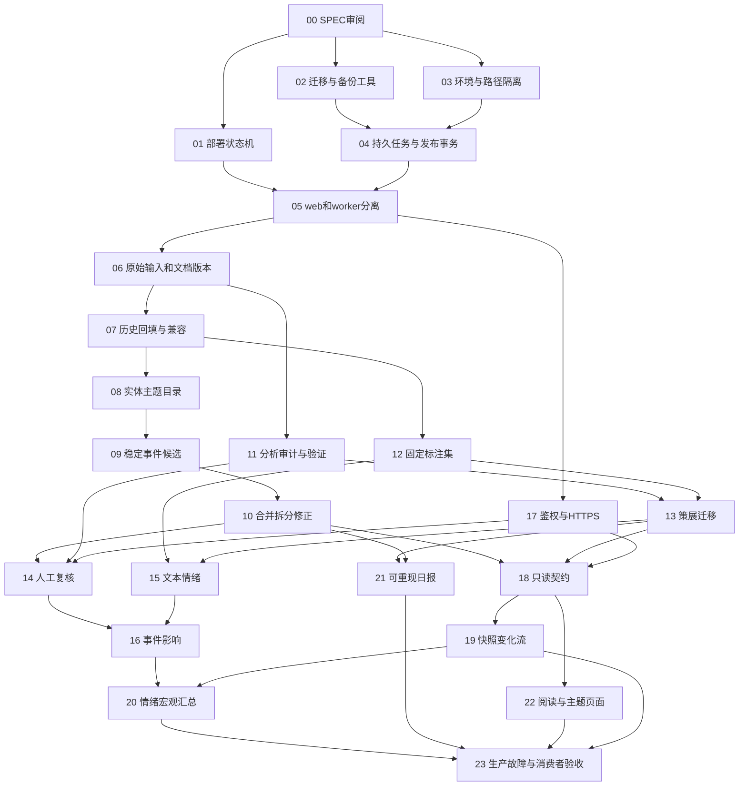

# 按依赖关系执行的 PR 路线图

状态：实施计划，尚未实施。每个编号是一份可独立审查的 PR 工作包；若 diff 仍混杂多个可部署行为，应再拆 a/b 子 PR。编号用于依赖，不要求按数字机械串行。

本轮只交付 P00 文档。现有 PR #1 保持未合并，作为素材引用；不能通过先合并它再“以后补审计”的方式绕过本计划。

## 1. 发布与开发规则

- Mac：在 `codex/…` 分支开发，用隔离数据库和关闭付费调用的测试环境。不得为测试复制生产 `.env` 到 Git。
- GitHub：一个 PR 描述一个具体问题、最终行为、SPEC 条款、数据变化、验收结果与回滚；main 才是生产发布候选。
- Windows：自动部署只接受登记的 main SHA 和成功检查，独立记录目标/构建/运行/健康版本。未合并分支不自动上线。
- 实施者（例如 Sol）先读根 SPEC、对应分册和前置 PR，核对真实 HEAD。发现契约矛盾先写修订说明，不能自行把“unknown”改成 0 或把新字段硬塞旧语义。
- 每 PR 必需：局部单元/集成测试；影响迁移时做旧库副本演练；影响模型时做固定数据集；影响页面时人工核心路径检查；不为文案或纯样式编写镜像式测试。
- 允许 feature flag/shadow projection 让中间 PR 上线；flag 必须在运行页可见，默认值与撤除条件在 PR 中记录。
- 测试数据与付费评估分开；CI 不请求真实新闻源和模型。生产升级不要在每次启动重复跑全部历史 NLP。
- 回滚优先恢复旧代码/发布指针，数据库只做兼容扩展。任何“恢复旧数据库”都按运维规范保全后续写入并更换同步 epoch。

## 2. 依赖总图

P17 编号靠后表示集成阶段，实际在复核管理页面启用前完成。黄金集 P12 可以先写标注指南和挑候选，但完整样本证据待 P06/P07 固化；不要等模型做完才定义正确答案。

## 3. 小型 PR 工作包

| PR / 阶段 | 依赖、仓库与范围 | 必须提供的验收证据 | 回滚与保留 |
|---|---|---|---|
| **P00 文档基线** | 本次 InfoHub SPEC；不改业务逻辑 | 现状证据、未知清单、链接/schema校验；审阅意见进入决策记录 | 文档可回退；不触发 DB 变更 |
| **P01 发布状态与失败恢复 / R1** | P00；**windows-server-manager 仓库**。显式项目/main配置、目标/健康SHA、共同互斥锁、固定SHA CI门禁、构建失败重试 | 在测试项目注入一次 build 失败，同SHA再次成功；错分支/dirty/CI失败不部署；手动与自动不能重叠 | 停自动任务，按已知健康镜像手动运行；保留旧管理器与发布状态文件。先提供迁移hook接口，P02后验证真实hook |
| **P02 迁移执行器和备份检查 / R1** | P00；InfoHub。版本/checksum、显式事务、基线识别、backup/verify命令；借用PR1思路，重写事务边界 | 两份本地副本和**新Windows导出副本**；失败DDL零残留、重复运行不变、未知schema拒绝、隔离恢复通过 | 只加迁移元表；不改旧内容字段；旧镜像可读。未拿到生产导出可合测试工具，不可宣称生产迁移验收 |
| **P03 环境与数据路径 / R1** | P00；InfoHub。环境ID、显式DB/blob路径、dev禁止生产任务默认、web/worker配置拆分准备 | dev测试不访问生产路径或网络；缺路径/错误env启动失败；迁移文件与运行库有明显标签 | 保持旧默认路径兼容一次发布周期；回滚配置不搬数据。停止Mac旧生产采集是后续明确运维动作，本次不执行 |
| **P04 持久任务与事务发布基础 / R1** | P02、P03；jobs/schedules、lease/fencing、幂等、dataset/epoch、change_log与事务发布函数 | crash/retry只发布一次；过期worker被拒；内容版本+change+job完成原子提交；序列不回退；空变更不造假事件；长事务/崩溃不能生成提交前可见证明，知识检查点不递归增长序列 | 新任务开关关闭；不得同时启动旧新两个scheduler。日志/任务保留可诊断 |
| **P05 web/worker与健康拆分 / R1** | P01、P04；InfoHub Compose与CLI。web不初始化/抓取，worker调度，live/ready/pipeline分开 | worker死掉web可读且显示延迟；重启恢复任务；未成功源非健康；自动部署就绪验证覆盖双进程 | 旧单进程镜像+停止新worker；明确旧路径只兼容仍受支持schema；不双写竞争 |
| **P06 原始记录与标准化 / R2** | P05；raw/CAS、ingest运行/观察、documents/versions；修同URL更正、时间与解析状态 | 同URL正文变化生新版本；重复抓取只增观察；source原时间保留；TIME_CONTRACT固定案例通过，SEC接收/申报日/公开时间和RSS更新分开、宿主TZ无关；HTML拦截不报空成功；blob缺失不发布 | 保留legacy投影和新原始对象；关闭新读取。无破坏性覆盖 |
| **P07 历史迁移与覆盖对照 / R2** | P06；旧item/discovery/report映射、可续跑回填、缺失/PIT标签 | 新Windows副本逐表ID/hash保存性；所有旧链接和NULL/空串有映射；kill后续跑无重复；差异报告零未解释丢失 | 暂停回填/切旧读；映射表与原库保留，不能重生成新ID |
| **P08 实体、主题与来源身份 / R2** | P07；entity/identifier/alias、taxonomy版本、多对多mentions与topic、publisher/origin | 现有13家US对象和源配置覆盖不退步；issuer/security/listing与ADR/多股类、6-K/20-F及修订有样本；同名歧义与人物/公司负例；移除/重加source配置生效；主题更名旧slug可解析；计数粒度明示 | 切旧展示投影；实体ID/版本不删除；不把现有company关联批量“清零重建” |
| **P09 稳定事件与候选 / R2** | P08；事件事实/证据/版本、文章多事件、legacy story映射；先shadow | 同财报期/产品版本/否认硬负例；不同报道同事实、单篇多事件；oldstory链接全解析。自动confirmed须等P12语义门槛 | 使用旧story展示，候选结果保留；不能删除历史story再重排 |
| **P10 事件演进与更正 / R2** | P09；merge/split/withdraw、支持/冲突关系、变化序列 | A→B→C归并链无循环；拆分/否认不篡改历史as_of；关系变更可观测；纯转载不改事实时间 | 停自动归并，追加修正版本恢复旧关系；不能物理撤销有下游引用的ID |
| **P11 不可变分析与统一调用 / R3** | P06、P04；run/attempt/result/input/publication、schema/evidence验证、费用与有限重试 | 同prompt重跑两模型都留存；同输入不同版本可审计；拒判不写tmt=0/-1；伪ID/越界/坏JSON不发布；预算上限有效 | 关候选分析发布、旧策展投影继续读；分析审计只追加。覆盖PR1 audit缺陷 |
| **P12 黄金集与基线 / R3** | P07；fixture格式、分层采样、标注指南、分组分割、评估runner | 600文档/150组/300影响目标样本计划的实际n与缺口；泄漏检查；人工一致性；现有算法基线；私有正文不入公共Git | 冻结旧dataset版本；新标注不覆盖旧gold；样本不足不宣称NLP通过 |
| **P13 现有策展迁入版本链 / R3** | P11、P12；translation/relevance/importance/filing type，取消覆盖原文与sentinel | 旧/新策展对照；宏观相关性召回达标；summary每个事实有证据；backfill/refusal/日报之外调用均经adapter | 切回上一publication/prompt；不回写假原文；旧API/网页按兼容投影读 |
| **P14 人工复核 / R3** | P10、P11、P17；内部review动作、乐观锁、权限、审计与复核页 | 人工改正不会被重跑覆盖；并发修改409；撤销生新动作；reader不能操作；CSRF与审计脱敏 | 关闭编辑入口；已发生人工修改保留有效，读页面继续呈现 |
| **P15 文本情绪 / R3** | P13；并使用P12数据。speaker/target/aspect/quote，unknown/mixed、校准状态 | tone门槛与混淆矩阵；转述/否定/反讽切片；无证据不输出neutral；置信度未校准有标签 | 关闭新task发布；保留旧分析版本 |
| **P16 事件影响 / R3** | P14、P15；target/aspect/horizon、条件机制、证据门禁、宏观数值提取 | impact门槛；actual/prior/revised区分；事件与模型版本匹配；unsupported强判断为0；单人gold只experimental | 下架候选publication，tone/原文继续；不得删旧信号使用过的结果 |
| **P17 鉴权与私网HTTPS / R4前置** | P05；InfoHub应用权限+管理器入口配置分属独立关联PR，不跨repo打包代码 | token哈希/撤销/scope/限流；TLS链和私网限制；敏感路径无匿名访问；日志无token | 保留只读私网页面；管理写接口保持关闭，不能回滚成匿名写 |
| **P18 类型化只读 API / R4** | P10、P13、P17；共享查询服务、完整DTO、浏览游标和历史查询 | OpenAPI实例校验、NULL/unknown语义、permission/pagination/as_of/knowledge_checkpoint_id、时间DTO与源语义；跨资源cursor失败；页面与接口一致 | v1未对外稳定前feature flag；已宣布稳定后按兼容策略，不无通知删字段 |
| **P19 快照与可靠增量 / R4** | P18、P04；snapshot worker、manifest/H、CDC、epoch/过期 | 并发写入中snapshot+changes逐ID/hash一致；检查点来源H与副本相符、保留期后可重建；晚到/修改/撤回/merge/split不丢；断点恢复/权限变化/恢复旧库演练 | 暂停新同步并返回503/明确重建；保留已发布change保留期，不能悄悄改游标含义 |
| **P20 宏观与情绪输出 / R4** | P16、P19；候选聚合公式、覆盖、模型组、来源偏差、版本manifest | 重复转载不加权；n<10为NULL；混合/未知分母可核；检查点不混入未来；美股日历有版本，23/25小时、早收市与跨日窗口不重计；模型切换分序列 | 切回旧formula publication；新旧版本可查询，不能覆盖历史分数 |
| **P21 可重现日报 / R4** | P13、P10；固定as_of/input清单、证据引用、版本、降级标签 | 自然日/美股交易日报告窗口与时区明确；重跑不覆盖旧版；迟到材料新revision；引用可定位；坏模型保留旧报告；采样审计报告 | 旧报告继续读取，新生成任务关闭；不能用“fallback”覆盖已发布LLM版本 |
| **P22 主题阅读与信息细节 / R5** | P18；精选/全部/主题/实体/事件/搜索/收藏状态；按页面再拆PR可独立发布 | 390px/1440px、键盘路径、计数/空态/多事件、原文/AI区别、旧链接与本地收藏兼容；不自动打断阅读 | 模板/静态资源回退，API语义与数据不变 |
| **P23 生产验收与消费者示例 / R5** | P19、P20、P21、P22；恢复/重启/预算/容量演练、最小消费者、运行手册 | 一次Windows隔离恢复、一次主机重启链、一次故障部署、一次真实消费者snapshot+更新+撤回；Windows时钟同步证据、回拨降级与知识检查点；规模/SLO实测与偏差公开 | 保留前健康镜像、备份和旧消费者路径；不强行宣称未通过项可用 |

P06必须再拆三个小PR：P06a原始载荷/观察持久化，P06b时间解析与逐源规则（包含冻结时间案例），P06c文档版本/更正与legacy投影。P06b依赖a，c依赖b；不得把全来源重写、历史全库回填与切读混在一起。P07仅在三者完成后开始。P08先做身份目录，再以单来源小PR补SEC表单/修订语义；扩大美股关注范围也应单独评审覆盖与成本。

## 4. 阶段退出条件

### R1：生产安全底座

P01–P05 完成，真实 Windows 副本可恢复，部署失败同SHA可重试；web与worker状态可区分；新旧schema兼容、未知版本拒绝。数据库文件搬到Linux volume不是退出必要条件，除非现场测试证明当前卷不能可靠满足要求。

### R2：证据与领域

P06–P10 完成；新采集原始保存与更正留痕覆盖100%；历史记录有一一映射且缺失诚实标注；旧story链接可解析；文章可多事件、事件可多报道、人工更正可追加。没有gold门槛的聚类仅标candidate。

### R3：可评估NLP

P11–P16及P17的管理鉴权完成。每个发布结果都能追到输入/模型/prompt/验证/证据；模型重跑不覆盖；人工优先；数据集/切片/拒判/费用报告齐全。未通过影响判断门槛可继续交付策展与tone，但不能宣布R3全部完成。

### R4：可集成服务

P17–P21完成；消费者以最小权限读取、snapshot+changes恢复一致；状态/缺失/历史时间语义稳定；日报与信号有可核manifest和覆盖。任何外部依赖未就绪应保留experimental标记。

### R5：持续运营

P22–P23完成；移动/桌面核心路径、备份恢复、重启链、容量与监控演练全部有记录。持续开发继续遵守同样PR契约，完成此期不表示后续不再迭代。

## 5. 审计问题到实施的映射

| 问题组 | 审计ID | 负责PR |
|---|---|---|
| 保存、时间与采集真实性 | A02–A04、A21–A22、A31–A32 | P06–P08 |
| 研究范围与分类 | A01、A05–A07 | P08、P13 |
| 事件/来源独立性 | A08–A10 | P09–P10、P12 |
| 模型审计/拒判/情绪 | A11–A14 | P11–P16 |
| 迁移与部署 | A15、A23–A24、A26–A27 | P01–P05、P23 |
| API与同步、可见时间 | A16–A17、A33 | P04、P17–P19、P23 |
| 日报 | A18 | P21 |
| 调度、锁与健康 | A19–A20、A25 | P04–P05、P23 |
| 阅读体验与文档 | A28–A30 | P00、P08、P22 |

## 6. 当前 PR #1 的处理方式

保留它的迁移登记、独立分析表、API分层方向和已有测试素材；在新PR中引用原提交并按SPEC重做，具体字段结论见[审计](AUDIT.md#5-pr-1-明确处理意见)。推荐完成对应替代PR后，才由维护者关闭原PR并链接替代记录。本次不会关闭或合并它。

尤其不能保留三个核心旧假设：同pipeline_version只留一份结果；published_at作为可靠变化水位；`with db`就足以保证所有DDL事务。它们分别破坏溯源、同步和故障恢复。

## 7. 实施 PR 描述模板

1. 问题与行为变化：用真实输入说明修改前后；引用SPEC与A/INV编号。
2. 范围：本PR处理的模块与必需前置。
3. 数据/契约：schema版本、兼容范围、输入输出/权限/时间变化。
4. 验证：提交号、测试和数据集版本、Windows演练结果、没测到的事项。
5. 发布：feature flag、默认值、迁移顺序、监控阈值。
6. 回滚：旧镜像/发布指针、数据保留、不可逆事项及恢复步骤。

不能用“测试通过，应该没问题”替代迁移与业务验收，也不要求每个小PR重新完成整个项目所有实验。
